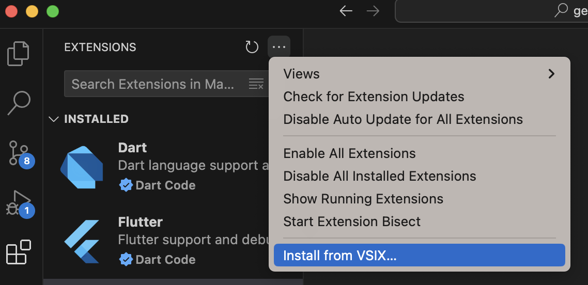
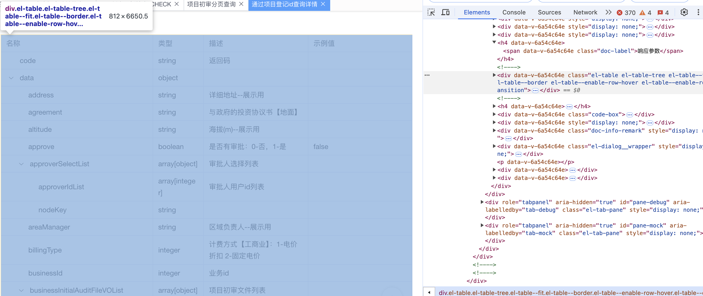
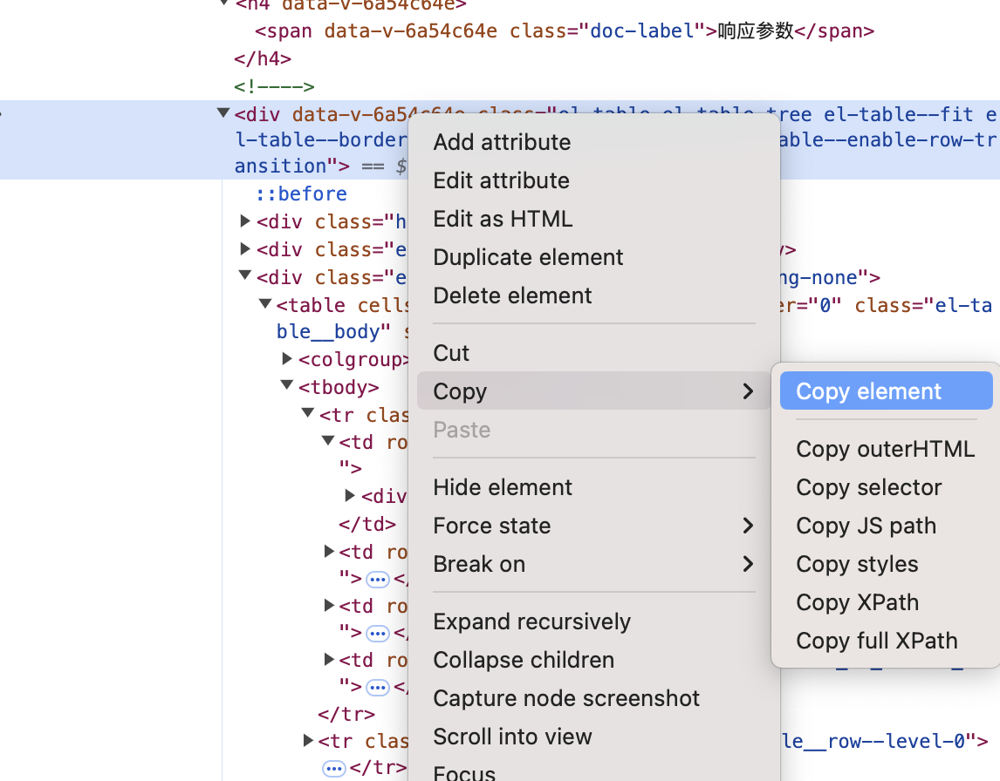
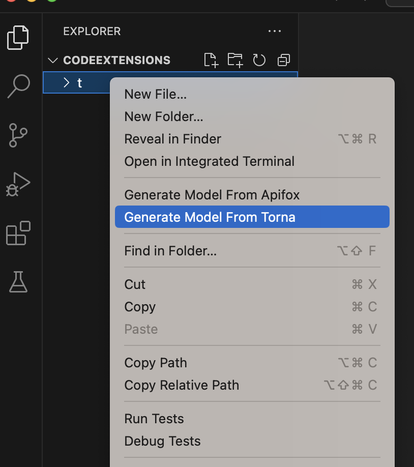
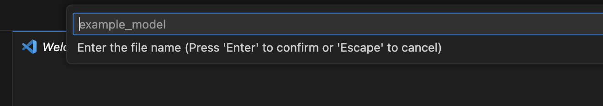
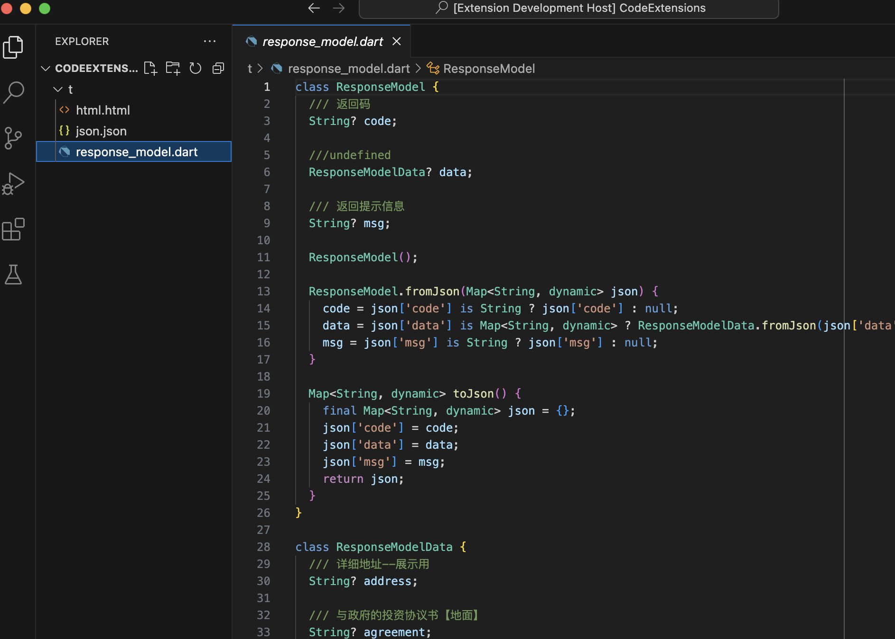
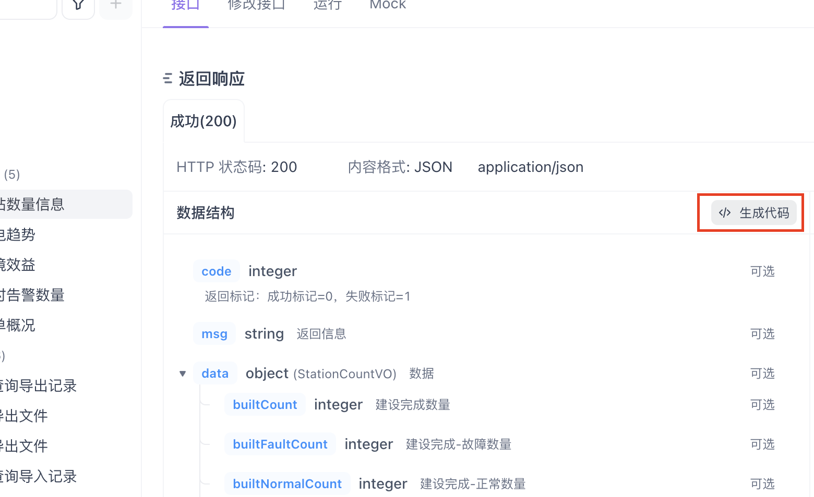
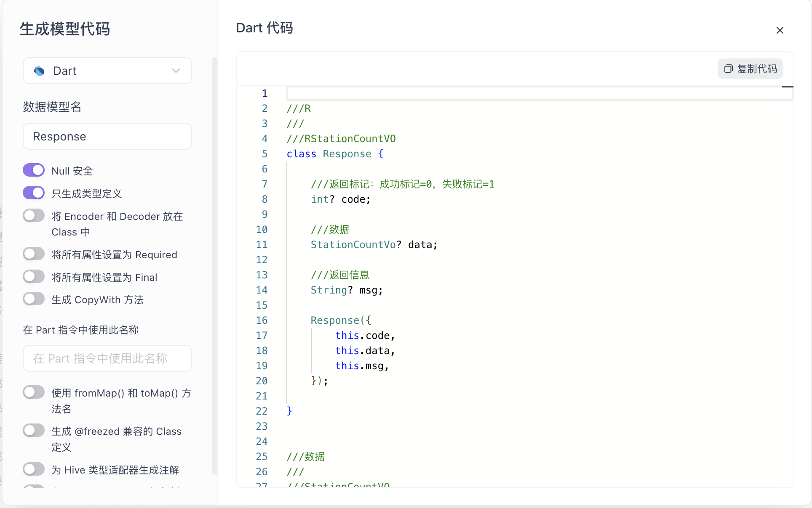

# generate-dart-model

## 打包
**1.安装vsce**
```
npm install -g @vscode/vsce
```

**2. 使用打包命令**
```
vsce package
```

## 安装
**1. 选中从vsix文件安装插件**



**2. 导入generate-dart-model-0.0.1.vsix**

## 用法

### 从torna生成

**1. 从torna选中响应参数表格的html标签**



**2. 复制整个html标签**



**3. 右键文件夹选中菜单Generate Model From Torna**



**4. 输入文件名，使用下划线分开，会自动生成驼峰式类名**



**5. 自动将粘贴板复制的html标签转化成dart model**



### 从apifox生成

**1. 从apifox选择生成代码**



**2. 选择复制生成的代码**



**3. 右键文件夹选中菜单Generate Model From Apifox**

**4. 输入文件名，使用下划线分开，会自动生成驼峰式类名**

**5. 自动将粘贴板复制的html标签转化成dart model**
